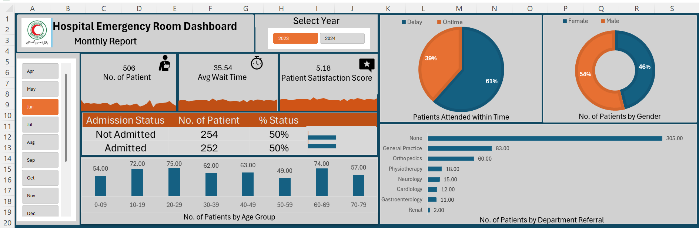

# 🏥 Hospital Emergency Room Dashboard

## 📌 Project Overview
This project analyzes **Hospital Emergency Room (ER) performance** using **Excel (Pivot Tables, Charts, and Power Query)**.  
The goal is to monitor **patient trends, waiting times, and satisfaction scores** to provide actionable insights.

## 📊 Final Dashboard
Below is the final ER Dashboard built in Excel:  

---

## 📂 Project Structure

---

## ⚙️ Steps Performed
1. **Data Preparation**
   - Imported raw ER dataset (`Hospital Emergency Room Data.csv`) into Excel.  
   - Cleaned and transformed using **Power Query**.  

2. **Data Modeling**
   - Built Pivot Tables for key metrics:  
     - Number of Patients per Day  
     - Average Waiting Time  
     - Patient Satisfaction Scores  

3. **Dashboard Development**
   - Combined all visuals into **DASHBOARD.xlsx**.  
   - Applied slicers & formatting for interactive analysis.  

---

## 🚀 Insights
- Daily patient flow helps in **staff allocation**.  
- Average wait times highlight **efficiency bottlenecks**.  
- Patient satisfaction trends show **service quality improvement areas**.  

---

## 🔗 Repository & Portfolio
- 📂 GitHub Repo: [Hospital Emergency Room Dashboard](https://github.com/ahmermehmood7/Hospital_Emergency_Room_Dashboard)  
- 💼 Portfolio: [Ahmer Mehmood](https://datascienceportfol.io/ahmermehmoodzz7)  
- 🔗 LinkedIn: [LinkedIn Profile](https://www.linkedin.com/in/ahmermehmood7)  

---

## 🛠️ Tools Used
- Microsoft Excel (Pivot Tables, Power Query, Dashboards)  
- CSV Data Files  
- GitHub for version control & sharing  

---
---
## 👨‍💻 Author
**Ahmer Mehmood**  
📧 Email: [ahmermehmood777@gmail.com](mailto:ahmermehmood777@gmail.com)  
💼 Portfolio: [datascienceportfol.io/ahmermehmoodzz7](https://datascienceportfol.io/ahmermehmoodzz7)  
🔗 LinkedIn: [linkedin.com/in/ahmermehmood7](https://www.linkedin.com/in/ahmermehmood7)  
📂 GitHub: [github.com/ahmermehmood7](https://github.com/ahmermehmood7)  

✨ This project demonstrates **end-to-end Excel analytics** — from raw data → cleaning → insights → dashboard visualization.  
